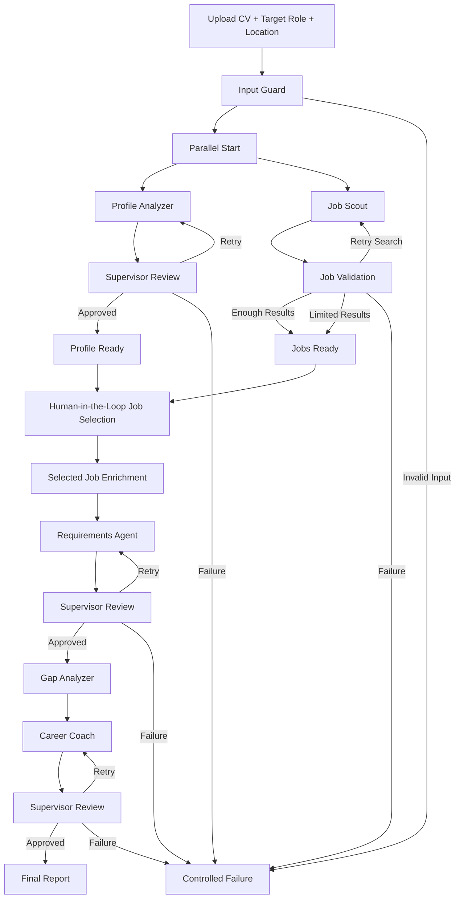

# SkillGap AI

**SkillGap AI** is a multi-agent career analysis system that compares a candidate's CV with real job opportunities, identifies verified skill gaps, and generates a practical development plan.

The system uses **LangGraph** to orchestrate multiple specialized agents, **OpenRouter** for LLM access, **Tavily** for live job discovery, and **FastAPI** to expose the workflow through a simple web interface.

---

## Overview

SkillGap AI helps a user answer three practical questions:

1. **Which current jobs are relevant to my target role and location?**
2. **Which required skills do I already have, and which ones are missing?**
3. **What should I learn or build next to improve my chances?**

The user uploads a PDF CV, enters a target role and location, reviews real job opportunities found by the system, selects one job, and receives a grounded skill-gap analysis and career development plan.

---

## Key Features

- PDF CV upload and text extraction
- Structured candidate profile analysis
- Live job search using Tavily
- Parallel execution of profile analysis and job discovery
- Job-result validation and search refinement
- Human-in-the-Loop job selection
- Job requirement extraction
- Deterministic skill-gap comparison
- Skill coverage calculation
- Evidence-gap detection for skills listed without clear supporting experience
- Prioritized learning recommendations
- Portfolio project recommendation
- Supervisor-based validation and retry logic
- Controlled failure handling
- LangGraph checkpointing for interrupted/resumed workflows
- FastAPI backend with a lightweight web frontend

---

## Multi-Agent Architecture

The system is composed of specialized agents, each responsible for a specific stage of the workflow.

| Component | Responsibility |
|---|---|
| **Profile Analyzer** | Extracts skills, projects, experience, education, skill evidence, and estimated experience level from the CV. |
| **Job Scout** | Searches for current job opportunities matching the target role and location using Tavily. |
| **Requirements Agent** | Extracts required skills, preferred skills, tools, frameworks, and other structured requirements from the selected job. |
| **Gap Analyzer** | Deterministically compares verified candidate skills with job requirements and calculates skill coverage. |
| **Career Coach** | Converts verified gaps into prioritized learning steps, a portfolio project, and an application recommendation. |
| **Supervisor** | Reviews selected agent outputs and decides whether to approve, retry, or stop with a controlled failure. |

---

## Workflow



### Parallel Execution

After input validation, the workflow fans out into two independent branches:

- **Profile Analyzer** analyzes the CV.
- **Job Scout** searches for relevant job opportunities.

LangGraph then waits for both branches to become ready before continuing to the Human-in-the-Loop job selection step.

---

## Human-in-the-Loop

SkillGap AI does not automatically choose a job for the user.

After the first stage completes, the LangGraph execution is paused using `interrupt()`. The frontend displays the available jobs, and the user chooses the opportunity they want to analyze.

The same workflow is then resumed using the stored `thread_id`, preserving the graph state through LangGraph checkpointing.

---

## Skill Gap Analysis

The Gap Analyzer uses deterministic comparison rather than asking an LLM to invent a match score.

It:

- normalizes skill names and common aliases
- removes duplicate skills
- identifies matching required skills
- identifies missing required skills
- separates preferred-skill matches
- detects skills that appear in the CV but have no clear supporting evidence
- calculates required-skill coverage

This keeps the final recommendations grounded in data extracted from the CV and the selected job.

---

## Tech Stack

### Backend and Orchestration

- Python
- FastAPI
- LangGraph
- LangChain
- Pydantic
- Uvicorn

### AI and Search

- OpenRouter
- OpenAI-compatible `ChatOpenAI`
- Tavily Search API

### File Processing

- PyPDF

### Frontend

- HTML
- CSS
- JavaScript

---

## Project Structure

```text
SkillGap-AI/
├── agents/
│   ├── __init__.py
│   ├── career_coach.py
│   ├── gap_analyzer.py
│   ├── job_scout.py
│   ├── profile_analyzer.py
│   ├── requirements_agent.py
│   └── supervisor.py
│
├── frontend/
│   └── index.html
│
├── .env.example
├── .gitignore
├── api.py
├── requirements.txt
├── skillgap_ai.py
└── README.md
```

---

## Environment Variables

Create a `.env` file in the project root:

```env
OPENROUTER_API_KEY=your_openrouter_api_key
OPENROUTER_MODEL=your_openrouter_model
TAVILY_API_KEY=your_tavily_api_key
```

You can copy the provided example file:

### macOS / Linux

```bash
cp .env.example .env
```

### Windows PowerShell

```powershell
Copy-Item .env.example .env
```

Then add your API keys and preferred OpenRouter model.

---

## Installation

### 1. Clone the repository

```bash
git clone <YOUR_REPOSITORY_URL>
cd SkillGap-AI
```

### 2. Create a virtual environment

```bash
python -m venv .venv
```

Activate it:

**Windows PowerShell**

```powershell
.\.venv\Scripts\Activate.ps1
```

**macOS / Linux**

```bash
source .venv/bin/activate
```

### 3. Install dependencies

```bash
pip install -r requirements.txt
```

### 4. Configure environment variables

Create `.env` from `.env.example` and fill in:

- `OPENROUTER_API_KEY`
- `OPENROUTER_MODEL`
- `TAVILY_API_KEY`

---

## Running the Application

Start the FastAPI server from the project root:

```bash
uvicorn api:app --reload
```

Then open:

```text
http://127.0.0.1:8000
```

FastAPI interactive documentation is available at:

```text
http://127.0.0.1:8000/docs
```

---

## API Endpoints

### Health Check

```http
GET /api/health
```

Returns the current API status.

### Start Analysis

```http
POST /api/start
```

Form fields:

- `cv` — PDF CV file
- `target_role` — desired role
- `location` — desired job location

The endpoint runs the first workflow stage and normally returns:

- a `thread_id`
- discovered jobs
- workflow execution logs
- a status indicating that the graph is waiting for job selection

### Select Job and Resume Workflow

```http
POST /api/select-job
```

JSON body:

```json
{
  "thread_id": "your-thread-id",
  "selected_job_index": 0
}
```

This resumes the interrupted LangGraph workflow and runs the remaining analysis.

---

## Final Output

The completed analysis includes information such as:

- candidate profile summary
- detected skills
- estimated experience level
- selected job and company
- required and preferred skills
- matching skills
- missing required skills
- evidence gaps
- skill coverage percentage
- priority skill gaps
- recommended learning order
- recommended portfolio project
- next action
- application recommendation

---

## Validation and Reliability

SkillGap AI includes several safeguards to reduce unsupported outputs:

- structured Pydantic outputs for LLM agents
- deterministic validation of important fields
- explicit skill evidence extraction
- deterministic skill matching and coverage calculation
- job-result validation
- limited retry counters
- Supervisor review stages
- controlled failure paths when outputs cannot be validated
- no automatic invention of job location when the search result does not provide one reliably

---

## Current Limitations

- The current demo accepts **PDF CV files only**.
- Scanned PDFs without extractable text may not work because the application does not currently perform OCR.
- Job quality depends on the search results returned by Tavily.
- LLM output quality depends on the OpenRouter model configured in `.env`.
- The current checkpoint store uses LangGraph's in-memory saver, so workflow state is not intended as persistent production storage.

---

## Requirements

The main Python dependencies are listed in `requirements.txt`:

```text
langchain-core
langchain-openai
pydantic
typing-extensions
python-dotenv
tavily-python
langgraph
fastapi
uvicorn
python-multipart
pypdf
```

---

## Future Improvements

Possible next steps include:

- persistent checkpoint storage
- authentication and user accounts
- saved analysis history
- support for DOCX CVs
- OCR support for scanned CVs
- improved job-source filtering
- automated tests for graph routes and agent validation
- deployment configuration for production environments

---

## License

Add the appropriate project license here if the repository will be distributed publicly.
